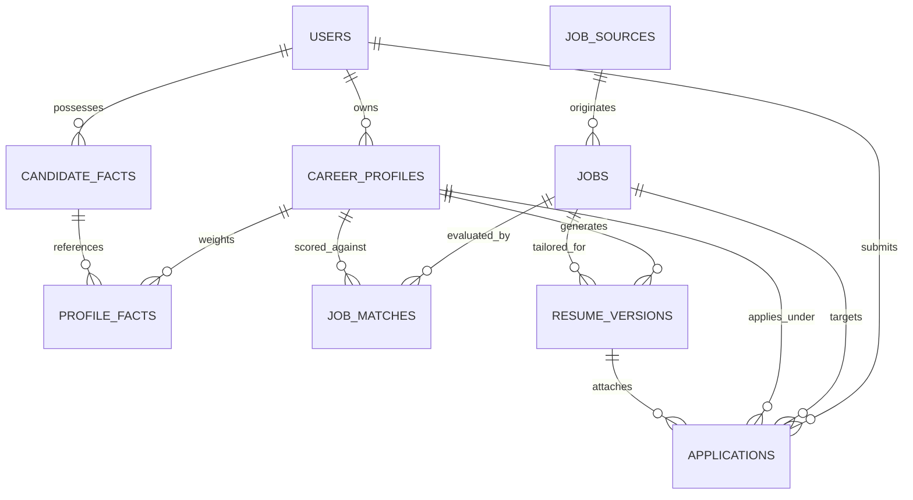

# Opporbyte

<div align="center">

**Your opportunities. One intelligent engine.**

[](https://github.com/el-oggy/Opporbyte/actions/workflows/ci.yml)
[](https://fastapi.tiangolo.com)
[](https://nextjs.org)
[](https://www.postgresql.org)
[](https://www.typescriptlang.org)
[](https://tailwindcss.com)
[](https://pytest.org)
[](#security-and-platform-compliance)

*A private, single-user, AI-powered job discovery, resume optimization, application management, and career automation platform.*

</div>

---

## Table of Contents

1. [Project Overview](#project-overview)
2. [Problem Statement](#problem-statement)
3. [Core Engineering Invariants](#core-engineering-invariants)
4. [Dual Engineering Career Profiles](#dual-engineering-career-profiles)
5. [Feature Matrix: Implemented Modules](#feature-matrix-implemented-modules)
6. [Technology Stack](#technology-stack)
7. [System Architecture](#system-architecture)
8. [Database Schema & Invariants](#database-schema--invariants)
9. [Job Discovery & Canonical Deduplication](#job-discovery--canonical-deduplication)
10. [AI Matching Engine (4-Factor Heuristic)](#ai-matching-engine-4-factor-heuristic)
11. [Zero-Hallucination ATS Resume Engine](#zero-hallucination-ats-resume-engine)
12. [Human-in-the-Loop Application Queue](#human-in-the-loop-application-queue)
13. [Career Analytics & Telemetry](#career-analytics--telemetry)
14. [Security & Platform Compliance](#security--platform-compliance)
15. [Repository Structure](#repository-structure)
16. [Local Installation & Setup](#local-installation--setup)
17. [Environment Configuration](#environment-configuration)
18. [Testing & Verification](#testing--verification)
19. [Completed Roadmap](#completed-roadmap)

---

## Project Overview

**Opporbyte** is a high-integrity, private software system engineered for an engineer managing dual career tracks. Rather than operating as a commercial multi-tenant SaaS with diluted abstractions, Opporbyte runs locally or in a private container, providing deterministic job discovery, strict factual resume provenance, and automated application tracking across **Semiconductor** and **Software** engineering domains.

---

## Problem Statement

Navigating modern technical careers across distinct engineering disciplines presents critical hurdles:
- **Domain Friction:** Hardware (VLSI/RTL/ASIC) and Software (Distributed Systems/Full Stack) hiring teams look for orthogonal signals. Generic resumes perform poorly across both.
- **ATS Black Boxes & Hallucination Risk:** Modern AI resume builders frequently invent technologies, fabricate metrics, or manipulate qualifications, destroying candidate credibility.
- **Application Fatigue & Accidental Duplication:** Candidates submitting applications frequently re-apply to the same canonical posting under different job boards or matching tracks, triggering automated rejection.
- **Scraping Frailty & Policy Violations:** Flaky headless scrapers break constantly, trigger CAPTCHAs, and violate platform terms of service.

Opporbyte resolves these challenges by coupling **permitted, structured ATS integrations** with a **zero-hallucination fact repository**, **cross-profile application deduplication**, and an **auditable 4-factor AI heuristic engine**.

---

## Core Engineering Invariants

1. **Zero Hallucination Guarantee:** Resumes are assembled strictly from human-verified candidate facts in `candidate_facts`. No skills, metrics, or employers are ever synthesized from thin air. Every generated bullet maintains foreign key provenance (`source_fact_ids`).
2. **Cross-Profile Application Deduplication:** The database enforces `UNIQUE (user_id, job_id)` on the `applications` table. If a job posting matches both Semiconductor and Software tracks, only a single application can ever be staged or submitted.
3. **Canonical Job Ingestion Hashing:** Duplicate job postings across multiple board feeds are merged via `canonical_hash = SHA-256(normalize(company) + ":" + normalize(title) + ":" + normalize(location))`.
4. **Permitted API Integrations Only:** Jobs are ingested exclusively through public, permitted ATS board APIs (Greenhouse, Ashby, Lever). No unauthorized scraping, CAPTCHA bypassing, or unapproved mass submissions.
5. **Human-in-the-Loop Governance:** Every application package requires explicit 1-click human verification and approval prior to submission.

---

## Dual Engineering Career Profiles

Opporbyte provides first-class support for two independent career domains:

| Profile Domain | Supported Engineering Focus Areas | Configuration Scope |
| :--- | :--- | :--- |
| **Semiconductor** | • VLSI Design<br/>• RTL Digital Design<br/>• ASIC Architecture<br/>• UVM / SystemVerilog Verification<br/>• FPGA Prototyping<br/>• Embedded Firmware<br/>• Logic Synthesis & STA<br/>• DFT & Silicon Bring-up | • Target Job Titles<br/>• Verified Technical Skills<br/>• Seniority / Experience Level<br/>• Hardware Projects & Tape-outs<br/>• Preferred Locations<br/>• Remote / Hybrid / On-site<br/>• Salary Expectations<br/>• Excluded Companies<br/>• Matching Threshold (50-95%) |
| **Software** | • Full Stack Development<br/>• Distributed Backend Systems<br/>• Microservices Architecture<br/>• Cloud-Native Infrastructure<br/>• Modern Web Frontends<br/>• High-Throughput APIs | • Target Job Titles<br/>• Verified Technical Skills<br/>• Seniority / Experience Level<br/>• Software Repositories & Highlights<br/>• Preferred Locations<br/>• Remote / Hybrid / On-site<br/>• Salary Expectations<br/>• Excluded Companies<br/>• Matching Threshold (50-95%) |

> **State Isolation Guarantee:** Modifying preferences, thresholds, or skills in the Semiconductor profile never mutates or alters the Software profile. Both profiles maintain independent state while referencing verified candidate facts.

---

## Feature Matrix: Implemented Modules

| Capability / Module | Status | Details |
| :--- | :---: | :--- |
| **Monorepo Architecture** | **COMPLETE** | Next.js 16 App Router frontend, FastAPI REST backend, PostgreSQL/SQLite ORM layer. |
| **Single-User Authentication** | **COMPLETE** | Native bcrypt hashing, signed JWT tokens, secure HTTP-only cookies, protected route dependencies. |
| **Dual Career Profiles** | **COMPLETE** | Isolated Semiconductor and Software profiles, live REST API persistence, independent parameters. |
| **10 Database Foundation Models** | **COMPLETE** | `User`, `CareerProfile`, `CandidateFact`, `ProfileFact`, `JobSource`, `Job`, `JobMatch`, `ResumeVersion`, `Application`, `TaskRun`. |
| **Permitted Job Discovery** | **COMPLETE** | Public REST adapters for Greenhouse, Ashby, and Lever boards with HTML cleaning. |
| **Canonical SHA-256 Deduplication** | **COMPLETE** | Company name normalization, location normalization, and collision-free hashing. |
| **4-Factor AI Matching Engine** | **COMPLETE** | Deterministic weights (40% skills, 25% experience, 20% alignment, 15% preferences) with evidence preservation. |
| **Candidate Facts Repository** | **COMPLETE** | Master fact database with human verification toggle, CV text extraction, and starter seeders. |
| **ATS Resume Tailoring Engine** | **COMPLETE** | Zero-hallucination fact selection, keyword scoring, ATS plain text and HTML exports. |
| **Human-in-the-Loop Pipeline** | **COMPLETE** | Staging queue, 1-click candidate approval, status progression, and cross-profile deduplication firewall. |
| **Career Analytics & Telemetry** | **COMPLETE** | Live match distributions, ATS average tracking, conversion funnel, and background task execution audits. |
| **Automated Test Suite** | **COMPLETE** | 27/27 passing Pytest tests covering authentication, discovery, matching, facts, resumes, and applications. |

---

## Technology Stack

### Frontend
- **Framework:** [Next.js](https://nextjs.org) (App Router, React 19, TypeScript)
- **Styling:** [Tailwind CSS v4](https://tailwindcss.com) with curated dark/light color palette
- **Icons:** [Lucide React](https://lucide.dev)
- **Views:** Overview (`/`), Discover (`/discover`), Profiles (`/profiles`), Resumes (`/resumes`), Applications (`/applications`), Analytics (`/analytics`), Settings (`/settings`), Login (`/login`)

### Backend
- **Framework:** [FastAPI](https://fastapi.tiangolo.com) (Python 3.12 managed via `uv`)
- **Data Validation:** [Pydantic v2](https://docs.pydantic.dev) & Pydantic-Settings
- **ORM & Data Access:** [SQLAlchemy 2.0](https://www.sqlalchemy.org)
- **Database Migrations:** [Alembic](https://alembic.sqlalchemy.org)
- **Security:** Native `bcrypt` key derivation + `PyJWT` signed tokens
- **Testing:** [Pytest](https://docs.pytest.org) with isolated SQLite in-memory fixtures and HTTPX

### Database & Persistence
- **Primary Database:** [PostgreSQL 16](https://www.postgresql.org) (Docker) & [SQLite](https://sqlite.org) (Local fallback)
- **Task Telemetry:** Background `TaskRun` auditing for ingestion and matching jobs

---

## System Architecture

```mermaid
graph TD
    subgraph Client Layer [Next.js 16 Web Dashboard]
        Overview["Overview & Matches Feed"]
        Discover["Permitted Job Discovery"]
        Profiles["Dual Profile Manager"]
        Resumes["Resume Studio (ATS Engine)"]
        Apps["Application Queue (Firewall)"]
        Analytics["Career Analytics & Telemetry"]
    end

    subgraph Security Layer
        Auth["Bcrypt Hashing & Signed JWT<br/>(HTTP-only Cookies / Bearer Header)"]
    end

    subgraph Backend Core [FastAPI REST Engine]
        API["FastAPI Master Router v1"]
        DiscoverySvc["Discovery Service (Greenhouse/Ashby/Lever)"]
        MatchSvc["AI Matching Engine (40/25/20/15 Heuristic)"]
        FactSvc["Candidate Facts Repository (Provenance)"]
        ResumeSvc["ATS Resume Engine (Zero-Hallucination)"]
        AppSvc["Application Pipeline (Deduplication Guard)"]
        AnalyticsSvc["Analytics & Task Telemetry Service"]
    end

    subgraph Persistence Layer
        DB[(PostgreSQL 16 / SQLite Database)]
        Alembic[Alembic Migrations]
    end

    Client Layer -->|Secure Session| Auth
    Auth --> API
    API --> DiscoverySvc
    API --> MatchSvc
    API --> FactSvc
    API --> ResumeSvc
    API --> AppSvc
    API --> AnalyticsSvc
    DiscoverySvc --> DB
    MatchSvc --> DB
    FactSvc --> DB
    ResumeSvc --> DB
    AppSvc --> DB
    Alembic --> DB
```

---

## Database Schema & Invariants



### Critical Database Constraints:
- **`uq_user_job_application`:** `UNIQUE (user_id, job_id)` on `applications` table blocks cross-profile duplicate applications.
- **`uq_canonical_hash`:** `UNIQUE (canonical_hash)` on `jobs` table guarantees single canonical storage per posting.
- **`uq_user_profile`:** `UNIQUE (user_id, profile_type)` enforces dual profile boundaries.
- **`uq_job_profile_match`:** `UNIQUE (job_id, profile_id)` stores exactly one evaluation per job per track.

---

## AI Matching Engine (4-Factor Heuristic)

Opporbyte ranks opportunities using a transparent, deterministic heuristic model:

$$\text{Overall Score} = (0.40 \times S_{\text{skills}}) + (0.25 \times S_{\text{experience}}) + (0.20 \times S_{\text{alignment}}) + (0.15 \times S_{\text{preferences}})$$

- **Skills Overlap ($40\%$):** Evaluates matching technical keywords against the active profile.
- **Experience Match ($25\%$):** Evaluates seniority alignment (Senior, Staff, Principal, Lead).
- **Career Alignment ($20\%$):** Matches job title against target roles.
- **Preferences ($15\%$):** Checks work mode (remote, hybrid, on-site) and location match.
- **Classifications:**
  - **Strong Match ($\ge 80\%$):** High alignment; candidate for priority tailoring.
  - **Potential Fit ($60-79\%$):** Baseline match with minor experience or skill gaps.
  - **Low Alignment ($< 60\%$):** Significant prerequisites missing.

---

## Zero-Hallucination ATS Resume Engine

- **Strict Fact Provenance:** Tailored resumes query verified facts (`verified == True`) from `candidate_facts`.
- **ATS Plain Text Export:** Generates clean, standard plain text resumes readable by Workday, Taleo, Greenhouse, and Lever.
- **Print-Ready HTML:** Generates modern, print-styled HTML resumes with clean typography and zero graphics clutter.
- **Provenance Citation:** Every bullet item maintains `source_fact_ids`, proving origin.

---

## Human-in-the-Loop Application Queue

- **Pipeline Stages:** `Draft` $\rightarrow$ `Ready for Review` $\rightarrow$ `Approved` $\rightarrow$ `Submitted` $\rightarrow$ `Interviewing` $\rightarrow$ `Offer` / `Rejected`.
- **1-Click Approvals:** Packages cannot be submitted without candidate review.
- **Cross-Profile Deduplication Guard:** Any attempt to apply to the same job under another profile is rejected with an explanatory message.

---

## Quickstart & Local Setup

### 1. Clone & Configure
```bash
git clone https://github.com/el-oggy/Opporbyte.git
cd Opporbyte
cp .env.example .env
```

### 2. Backend Setup
```bash
cd backend
# Managed via uv / Python 3.12
.\.venv\Scripts\activate

# Install dependencies & run migrations
pip install -r requirements.txt
alembic upgrade head

# Bootstrap initial user and starter profiles
python -m app.core.init_db

# Start backend server
uvicorn app.main:app --host 127.0.0.1 --port 8000 --reload
```
*API Documentation: `http://localhost:8000/api/v1/docs`*

### 3. Frontend Setup
```bash
cd frontend
npm install
npm run dev
```
*Web Dashboard: `http://localhost:3000`*

---

## Testing & Verification

### Running Backend Pytest Suite
```bash
cd backend
.\.venv\Scripts\python -m pytest tests -v
```
**27 passing tests** covering:
- Authentication, tokens, password hashing, and logout
- Dual career profile isolation and persistence
- Permitted job discovery, HTML cleaning, and SHA-256 deduplication
- 4-factor heuristic matching engine and blacklist exclusion
- Candidate facts CRUD, verification toggle, and CV text extraction
- Zero-hallucination resume tailoring, ATS scoring, and text/HTML exports
- Application pipeline lifecycle, status transitions, and cross-profile deduplication
- Career analytics summary and background task audits

### Running Frontend Build Verification
```bash
cd frontend
npm run build
```
*Validates static rendering and strict TypeScript compilation across all 9 App Router routes.*

---

## Completed Roadmap

- [x] **Phase 1: Foundation & Dual Profile Architecture**
  - [x] Monorepo structure, FastAPI backend, Next.js 16 frontend.
  - [x] Single-user authentication with bcrypt and HTTP-only cookies.
  - [x] 10 SQLAlchemy ORM models with Alembic migrations.
  - [x] Semiconductor & Software profile management.
- [x] **Phase 2: Permitted Job Discovery & AI Matching Engine**
  - [x] Greenhouse, Ashby, and Lever public API providers.
  - [x] SHA-256 canonical deduplication hashing.
  - [x] 4-factor AI heuristic matching with evidence preservation.
  - [x] Interactive ATS board ingestion modal.
- [x] **Phase 3: Zero-Hallucination ATS Resume Engine & Application Pipeline**
  - [x] Candidate Facts repository with human verification.
  - [x] ATS Resume Tailoring Engine with zero-hallucination guarantee.
  - [x] Clean plain text and print-ready HTML exports.
  - [x] Human-in-the-loop application queue with cross-profile deduplication firewall.
- [x] **Phase 4: Analytics, Telemetry, and Production Polish**
  - [x] Career Analytics & TaskRun telemetry dashboard.
  - [x] 27/27 passing Pytest test suite.
  - [x] Complete system documentation and architecture guides.