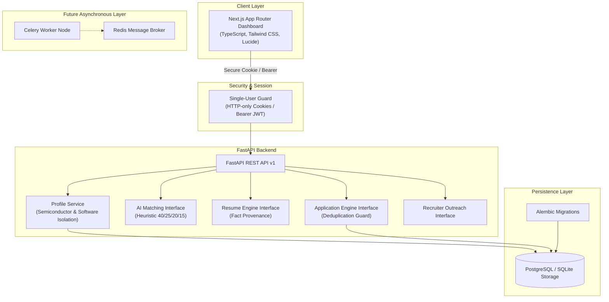

# Opporbyte System Architecture

> **Tagline:** Your opportunities. One intelligent engine.  
> **Status:** Phase 1 Foundation Implemented

---

## 1. Architectural Philosophy

Opporbyte is designed as a **private, single-user, high-integrity career automation engine**. Rather than operating as a multi-tenant commercial SaaS with compromise-driven abstractions, Opporbyte is engineered for uncompromising local security, privacy, fact provenance, and deterministic execution.



---

## 2. Monorepo Organization

```
Opporbyte/
├── frontend/                  # Next.js App Router SPA & SSR
│   ├── app/                   # App Router pages and layout
│   │   ├── (auth)/login/      # Single-user authentication interface
│   │   ├── (dashboard)/       # Authenticated application views
│   │   │   ├── discover/      # Job discovery explorer
│   │   │   ├── profiles/      # Dual-profile configuration editor
│   │   │   ├── resumes/       # Resume studio
│   │   │   ├── applications/  # Application pipeline queue
│   │   │   ├── analytics/     # Match and conversion analytics
│   │   │   └── settings/      # System credentials & preferences
│   │   ├── globals.css        # Tailwind styling & theme tokens
│   │   └── layout.tsx         # Root document & providers
│   ├── components/            # Modular, typed React components
│   │   ├── ui/                # Base design system primitives
│   │   ├── dashboard/         # Metric cards, feeds, charts
│   │   └── profiles/          # Domain-isolated profile editors
│   ├── hooks/                 # Custom React state & API hooks
│   ├── lib/                   # API client, cookies, utilities
│   └── types/                 # TypeScript contract types
├── backend/                   # Python FastAPI REST Service
│   ├── app/
│   │   ├── api/v1/            # Versioned API routes (auth, profiles, health)
│   │   ├── core/              # Config, security, hashing, bootstrap
│   │   ├── db/                # SQLAlchemy session & base classes
│   │   ├── models/            # 10 Phase 1 & Foundation ORM models
│   │   ├── schemas/           # Pydantic request/response validations
│   │   └── services/          # Business logic and abstract engine interfaces
│   ├── alembic/               # Database migration scripts
│   ├── tests/                 # Pytest test suite (100% Phase 1 coverage)
│   ├── Dockerfile             # Production container definition
│   └── requirements.txt       # Pinned backend dependencies
├── docs/                      # Architectural & functional specifications
├── .github/workflows/         # Automated GitHub Actions CI pipeline
├── docker-compose.yml         # Containerized local orchestration
├── .env.example               # Environment variables template
└── README.md                  # Comprehensive project documentation
```

---

## 3. Security & Authentication Model

### Single-User Isolation
Opporbyte is configured with single-user authorization. Credentials (`FIRST_USER_EMAIL` and `FIRST_USER_PASSWORD`) are bootstrapped via environment configuration outside the source tree.

- **Password Hashing:** Native `bcrypt` key derivation with high work factor (`rounds=12`).
- **Session Tokens:** Signed JWTs using `HS256` containing non-forgeable subject claims (`sub`) and expiration bounds.
- **Dual Transport Security:** Tokens are transmitted via both:
  1. **HTTP-only, Secure Cookies:** Protected against cross-site scripting (XSS) with `SameSite=Lax` enforcement.
  2. **Bearer Authorization Headers:** Enabled for programmatic testing and client resilience.
- **Server-Side Enforcement:** Every sensitive endpoint is guarded by `get_current_active_user`, verifying token signature, expiration, and database user activation before executing logic.

---

## 4. Dual Career Profile Isolation

Opporbyte provides first-class support for two distinct engineering tracks:
1. **Semiconductor:** Focuses on hardware engineering, RTL design, digital architecture, verification, and embedded physical design.
2. **Software:** Focuses on distributed backend architectures, modern web frontends, systems engineering, and scalable APIs.

### Isolation Guarantees:
- **Independent Preferences:** Each profile maintains its own target job titles, technical skills, experience level, salary expectations, preferred work modes, and matching threshold.
- **Zero Cross-Contamination:** Editing or updating the Semiconductor profile does not mutate or alter the Software profile.
- **Shared Fact Provenance:** While both profiles can link to canonical, verified candidate facts from the central fact repository (`CandidateFact`), fact weights and relevance flags are stored separately in `ProfileFact`.
