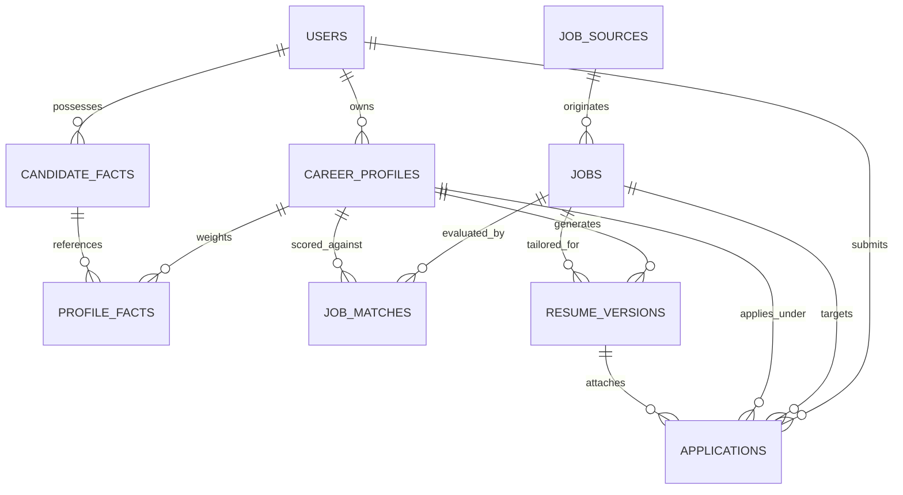

# Opporbyte Database Architecture & Schema Specification

Opporbyte utilizes **PostgreSQL** in production/Docker environments, with seamless **SQLite** compatibility for lightweight local testing. Schema revisions are governed strictly through **Alembic**.

---

## 1. Entity-Relationship Overview

---

## 2. Model Specifications

### 1. `users`
Core single-user authentication identity.
- `id` (VARCHAR(36), PK): UUID identifier.
- `email` (VARCHAR(255), UNIQUE, INDEX): Login email.
- `hashed_password` (VARCHAR(255)): Bcrypt password digest.
- `full_name` (VARCHAR(255), NULLABLE): Candidate display name.
- `is_active` (BOOLEAN): Account operational status.
- `is_superuser` (BOOLEAN): Administrative privilege flag.
- `created_at` / `updated_at` (TIMESTAMP WITH TIME ZONE).

### 2. `career_profiles`
Dual independent domain configurations.
- `id` (VARCHAR(36), PK): UUID identifier.
- `user_id` (VARCHAR(36), FK -> `users.id`, INDEX): Owner.
- `profile_type` (VARCHAR(50), INDEX): Domain discriminator (`semiconductor` or `software`).
- `title` (VARCHAR(255)): Human-readable profile headline.
- `summary` (TEXT): High-level career overview.
- `target_job_titles` (JSON): Array of target roles (e.g. `["VLSI", "RTL Design", "ASIC"]`).
- `technical_skills` (JSON): Array of candidate-verified skills.
- `experience_level` (VARCHAR(50)): Seniority level (`Entry`, `Mid-level`, `Senior`, `Staff`).
- `projects` (JSON): Structured project portfolio.
- `preferred_locations` (JSON): Target cities/regions.
- `work_preference` (JSON): Array (`remote`, `hybrid`, `on-site`).
- `employment_type` (JSON): Array (`full-time`, `internship`).
- `salary_expectation` (JSON): Minimum, target, and currency specification.
- `excluded_companies` (JSON): Blacklisted organizations.
- `matching_threshold` (INTEGER, 0-100): Minimum qualification bar.
- **Constraint:** `UNIQUE (user_id, profile_type)` prevents duplicate domain profiles per user.

### 3. `candidate_facts`
Central canonical repository of verified achievements, skills, and work history.
- `id` (VARCHAR(36), PK): UUID identifier.
- `user_id` (VARCHAR(36), FK -> `users.id`, INDEX): Owner.
- `category` (VARCHAR(50), INDEX): Category (`skill`, `experience`, `education`, `project`, `certification`).
- `title` (VARCHAR(255)): Descriptive fact summary.
- `description` (TEXT): Verified evidentiary detail.
- `verified` (BOOLEAN): Human-verified truth status.
- `source` (VARCHAR(100)): Origin audit tag (`manual`, `imported_resume`).

### 4. `profile_facts`
Relational join between candidate facts and specific career profiles.
- `id` (VARCHAR(36), PK): UUID.
- `profile_id` (VARCHAR(36), FK -> `career_profiles.id`, INDEX).
- `fact_id` (VARCHAR(36), FK -> `candidate_facts.id`, INDEX).
- `relevance_weight` (FLOAT): Importance multiplier (0.0 to 2.0).
- `is_highlighted` (BOOLEAN): Priority placement flag.
- **Constraint:** `UNIQUE (profile_id, fact_id)`.

### 5. `job_sources`
Registry of permitted external job board APIs (Greenhouse, Ashby, Lever, etc.).
- `id` (VARCHAR(36), PK): UUID.
- `name` (VARCHAR(100), UNIQUE): Provider key.
- `base_url` (VARCHAR(255)): Base endpoint.
- `is_active` (BOOLEAN): Ingestion status.
- `rate_limit_per_minute` (INTEGER): Rate throttling quota.
- `last_polled_at` (TIMESTAMP WITH TIME ZONE, NULLABLE).

### 6. `jobs`
Canonical deduplicated postings.
- `id` (VARCHAR(36), PK): UUID.
- `source_id` (VARCHAR(36), FK -> `job_sources.id`, NULLABLE, INDEX).
- `external_id` (VARCHAR(255), NULLABLE): Upstream ATS job identifier.
- `canonical_hash` (VARCHAR(64), UNIQUE, INDEX): Cryptographic fingerprint (`SHA-256(normalized_company + normalized_title + normalized_location)`) ensuring zero duplicates.
- `title` (VARCHAR(255), INDEX).
- `company` (VARCHAR(255), INDEX).
- `location` (VARCHAR(255)).
- `employment_type` (VARCHAR(50)).
- `work_mode` (VARCHAR(50)): `remote`, `hybrid`, `on-site`.
- `description` (TEXT): Full posting text.
- `url` (VARCHAR(1024)): Direct application URL.

### 7. `job_matches`
AI evaluation records binding jobs to career profiles.
- `id` (VARCHAR(36), PK): UUID.
- `job_id` (VARCHAR(36), FK -> `jobs.id`, INDEX).
- `profile_id` (VARCHAR(36), FK -> `career_profiles.id`, INDEX).
- `overall_score` (INTEGER, 0-100).
- `required_skills_score` (INTEGER, 0-100, 40% weight).
- `experience_score` (INTEGER, 0-100, 25% weight).
- `alignment_score` (INTEGER, 0-100, 20% weight).
- `preferences_score` (INTEGER, 0-100, 15% weight).
- `classification` (VARCHAR(50)): `strong` (80-100), `potential` (60-79), `low` (0-59).
- `match_evidence` (JSON): Explanations, skill intersections, missing prerequisites.
- **Constraint:** `UNIQUE (job_id, profile_id)`.

### 8. `resume_versions`
Tailored, ATS-optimized resume artifacts.
- `id` (VARCHAR(36), PK): UUID.
- `profile_id` (VARCHAR(36), FK -> `career_profiles.id`, INDEX).
- `job_id` (VARCHAR(36), FK -> `jobs.id`, NULLABLE, INDEX).
- `version_name` (VARCHAR(255)).
- `summary` (TEXT): Grounded professional synthesis.
- `selected_facts` (JSON): Verified facts included in compilation.
- `ats_score` (INTEGER, NULLABLE): Estimated ATS compatibility index.
- `pdf_storage_path` (VARCHAR(512), NULLABLE): Local file path.
- `is_master` (BOOLEAN): Master template indicator.

### 9. `applications`
Strict application tracker and deduplication firewall.
- `id` (VARCHAR(36), PK): UUID.
- `user_id` (VARCHAR(36), FK -> `users.id`, INDEX).
- `job_id` (VARCHAR(36), FK -> `jobs.id`, INDEX).
- `profile_id` (VARCHAR(36), FK -> `career_profiles.id`, INDEX).
- `resume_version_id` (VARCHAR(36), FK -> `resume_versions.id`, NULLABLE).
- `status` (VARCHAR(50), INDEX): `draft`, `ready_for_review`, `approved`, `submitted`, `interviewing`, `offer`, `rejected`.
- `submission_method` (VARCHAR(50)): `manual`, `authorized_portal`, `recruiter_outreach`, `email`.
- `submitted_at` (TIMESTAMP WITH TIME ZONE, NULLABLE).
- `notes` (TEXT, NULLABLE).
- **CRITICAL CONSTRAINT:** `UNIQUE (user_id, job_id) [uq_user_job_application]`
  > **Deduplication Invariant:** Even if a canonical job (e.g., *Embedded Firmware & RTL Engineer*) matches **both** the Semiconductor profile and the Software profile, only **one** application record can exist in the system for that user and job.

### 10. `task_runs`
Audit and telemetry logging for background tasks.
- `id` (VARCHAR(36), PK): UUID.
- `task_type` (VARCHAR(100), INDEX): Task discriminator.
- `status` (VARCHAR(50), INDEX): `pending`, `running`, `completed`, `failed`.
- `parameters` (JSON, NULLABLE).
- `result` (JSON, NULLABLE).
- `error_message` (TEXT, NULLABLE).
- `started_at` / `completed_at` (TIMESTAMP WITH TIME ZONE).
