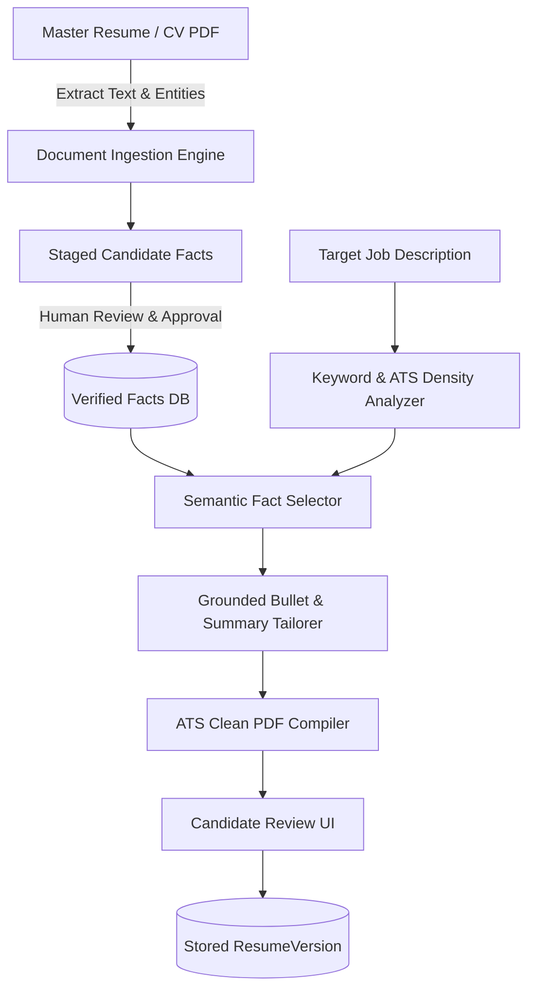

# Opporbyte ATS Resume Engine Specification (Design Only)

> **Status:** Specification & Typed Interfaces Implemented in Phase 1 (`app/services/interfaces/resume.py`)  
> **Target Execution:** Phase 3 Engine Activation

---

## 1. Zero Hallucination Guarantee

The hallmark requirement of Opporbyte's Resume Engine is **strict factual provenance**. Standard generative AI often embellishes, invents, or hallucinates technologies, company tenures, or project metrics. In Opporbyte:
- **Rule 1:** The engine can **only** synthesize content from candidate facts marked as `verified = true` in the `candidate_facts` table.
- **Rule 2:** Every generated bullet point or summary phrase stores explicit foreign key links (`source_fact_ids`) back to original candidate facts.
- **Rule 3:** The user maintains human-in-the-loop review before any resume is compiled or staged for submission.

---

## 2. Ingestion & Fact Extraction Flow

---

## 3. Dynamic Tailoring Engine

When tailored for a target job posting:
1. **Keyword Mapping:** Identifies role-critical terminology (e.g., *UVM testbench architecture*, *timing closure*, *Next.js Server Actions*, *PostgreSQL indexing*).
2. **Fact Selection:** Queries candidate's verified repository and ranks relevant items according to the active career profile (`profile_facts.relevance_weight`).
3. **Framing & Emphasis:** Dynamically reframes truthful project achievements to highlight the exact impact parameters valued by the target posting.
4. **ATS Compliant PDF Generation:** Compiles cleanly to PDF with:
   - Single-column standard formatting (no tables, complex columns, or non-standard glyphs).
   - Machine-parseable headings (`Work Experience`, `Technical Skills`, `Education`, `Projects`).
   - Standard UTF-8 typography.
